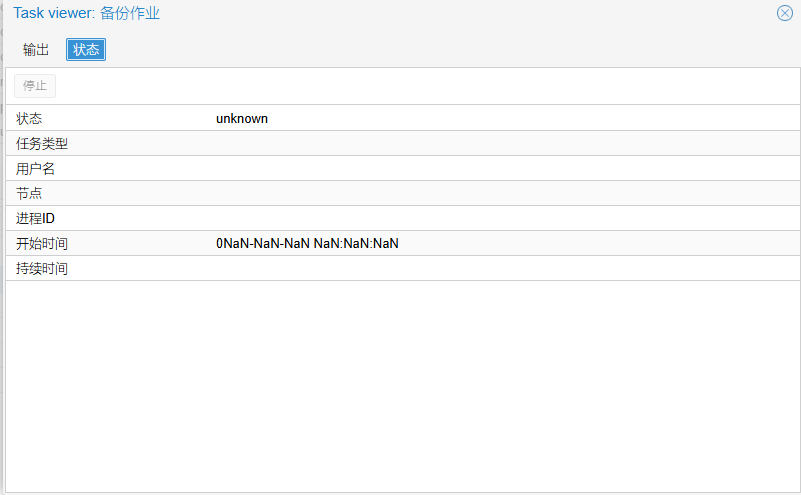

# 备份任务卡死问题解决方案
原始链接：[https://www.280i.com/series/pve](https://www.280i.com/series/pve)

## 技术信息

**卡死效果:**


**备份任务信息无法查看：**


**常规解决流程：**

```bash
vzdump -stop #停止备份任务
ps awxf | grep vzdump #查看进程
kill -9
```

本次经过上面的操作，进程依旧无法停止。

**论坛反馈问题和解决办法：**
1. 重启服务器 # 此操作未肯定可以，但由于环境问题，未重启。
2. NFS挂载异常，一直等待问题。

**最终解决办法：**
重启NFS服务器，重新建立连接。稍等进程恢复，会自动进行下一步备份。

参考资料：
https://forum.proxmox.com/threads/backup-job-is-stuck-and-i-cannot-stop-it-or-even-kill-it.120835/