---
title: Cloud-Init 配置指南
tags: [Proxmox, 技术, 网络收藏]
# Cloud-Init 配置指南
原始链接：[https://www.280i.com/series/pve](https://www.280i.com/series/pve)
## 技术信息
此文章和上篇一样，是英文的翻译收藏版本，本文采用cloud-init是唯一的不通
原文https://blog.cbugk.com/post/proxmox-cloudinit-arm64-vm/：https://blog.cbugk.com/post/proxmox-cloudinit-arm64-vm/
译文：
这是通过仿真在 Proxmox （amd64） 上运行 64 位 ARM 操作系统的指南。虽然cloudinit是这里的魅力所在，但用于手动安装操作系统的普通ISO挂载也可以。
本指南假定您具有在Proxmox VE Web UI上设置VM的经验，并且熟悉CLI。
以下是在有序列表中执行的步骤。终端使用是最小的，但是，请查看 Techno Tim 的笔记和 Proxmox VE 文档，用于创建和修改 VM。如果之前没有设置过 cloudinit，观看 Techno Tim 的视频是一个好的开始。
为什么？
除了炫耀之外，我能想到的主要实用程序是为 arm64 平台进行流水线软件测试。然而，这样做的问题是绝对有必要拥有足够通用的工作负载，并且无法在另一个平台（例如，amd64/x86_64）上进行验证。
由于硬件配置过于具体，这在嵌入式平台上是行不通的，所以原因可能是缺乏早期“迁移/退出 ARM”的资金测试，或者“因为我可以”。让我们开始吧……
观察
1.机器（主板）类型必须为 i440fx。对于q35，遇到以下错误。老实说，我不知道原因，无论出于何种原因，似乎都是枚举错误。 qemu-system-aarch64: -device usb-ehci,id=ehci,bus=pci.0,addr=0x1: Duplicate ID 'ehci' for device 2.BIOS 类型应为 OVMF （UEFI），否则 VM 将无法启动。
这应该是由于 ARM 系列没有 x86 系列的启动约定。
3.EDK2 的必要性必须像在 Android 固件上一样强制执行 UEFI。不要引用我的话。
必须在任何虚拟机监控程序节点上安装适用于 ARM 的 EDK2 固件才能运行/存储 arm64 虚拟机：。pve-edk2-firmware-aarch64
在配置文件上更改 CPU 类型后，必须添加 EFI 磁盘。
确保为订阅和非订阅存储库正确配置 APT 源。
4.磁盘类型：
VirtIO 块设备完美运行。
SCSI格式
只有VirtIO SCSI可以工作。
VMWare 兼容和 VirtIO SCSI Single 出现以下错误： qemu-system-aarch64: -device virtio-scsi-pci,id=virtioscsi0,bus=pcie.3,addr=0x1: Bus 'pcie.3' not found MegaRAID卡（例如LSI 53C895A）允许VM启动，但由于缺少驱动程序/内核模块而无法启动。
IDE 错误： qemu-system-aarch64: -device ide-hd,bus=ide.0,unit=0,drive=drive-ide0,id=ide0,rotation_rate=1: Bus 'ide.0' not found 5.配置文件中的必要更改，这些更改在WebUI上不存在，因此应通过CLI执行：
arch: aarch64必须添加。
vmgenid:必须删除或出现以下错误： qemu-system-aarch64: -device vmgenid,guid=c2826a61-f1e6-44b3-876a-b5f82a0d17cb: 'vmgenid' is not a valid device model name cpu:最简单的方法是删除或设置为 。QEMU 文档中列出了可用选项。但是，例如，VM 会发出警告并继续启动。max cortex-a55 vm 100 – unable to parse value of ‘cpu’ – Built-in cputype ‘cortex-a55’ is not defined (missing ‘custom-‘ prefix?)
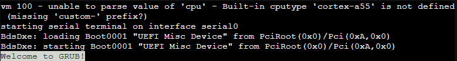
6.最好在几秒钟后启动并打开控制台（序列号 0）。否则，在用户输入之前，屏幕可能无法正确更新，这并不理想。
循序渐进
弹出目标虚拟机管理程序节点的 shell 窗口，并将目录更改为新工作区： mkdir -p ~/prj/arm-deb-cloud
cd ~/prj/arm-deb-cloud 1.将 Debian Bookworm： latest generic cloud image 作为 qcow2 下载到目标节点上。校样读取以确保它是 arm64 而不是 amd64 不会浪费一个小时尝试启动 VM，不要问我为什么！ wget https://cloud.debian.org/images/cloud/bookworm/latest/debian-12-genericcloud-arm64.qcow2 2.创建无盘 VM，也不要添加 EFI 磁盘：
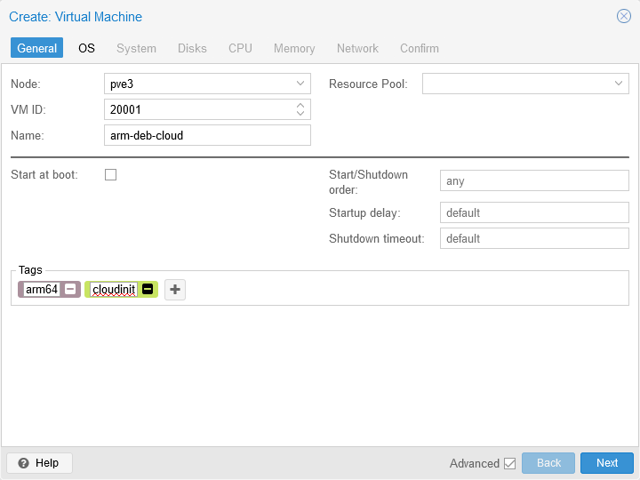
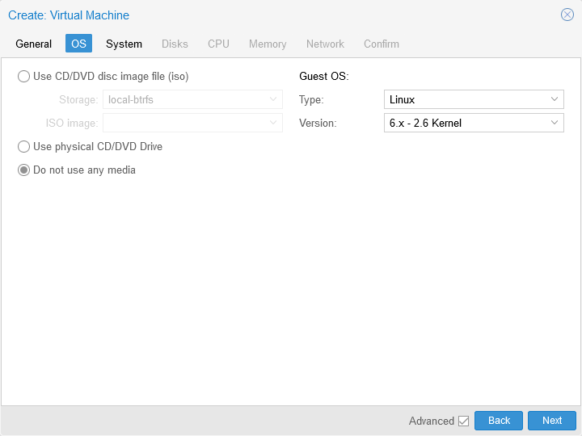
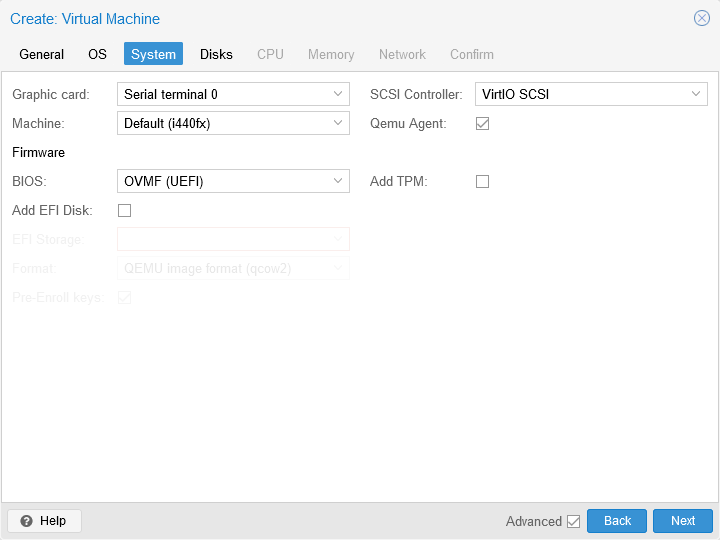
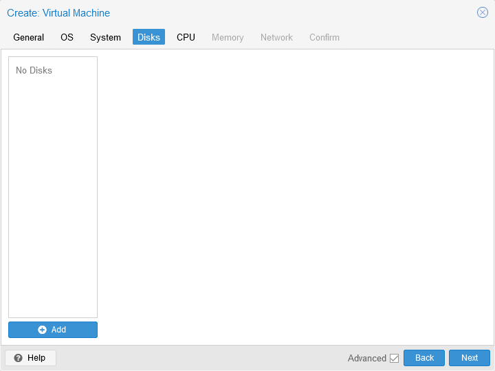
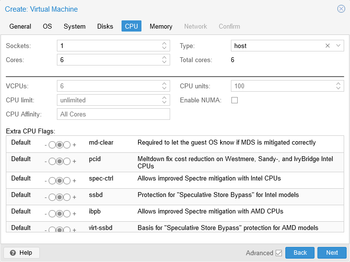
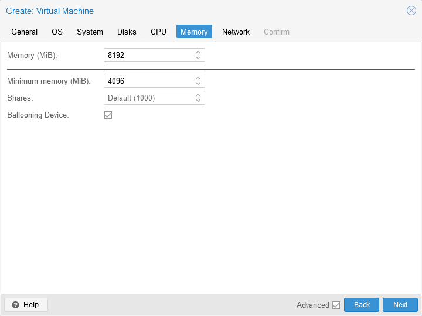
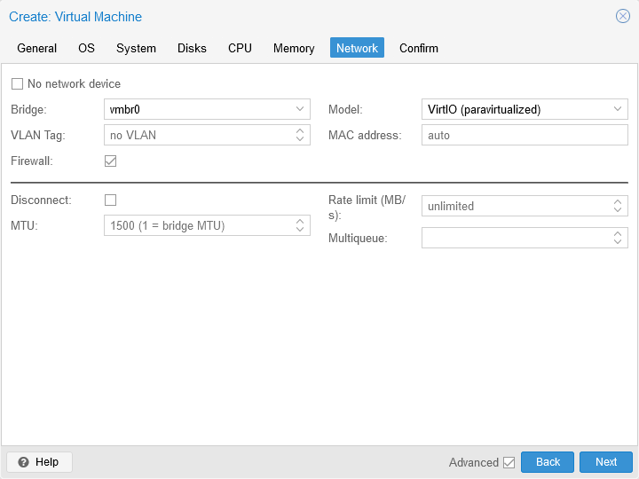
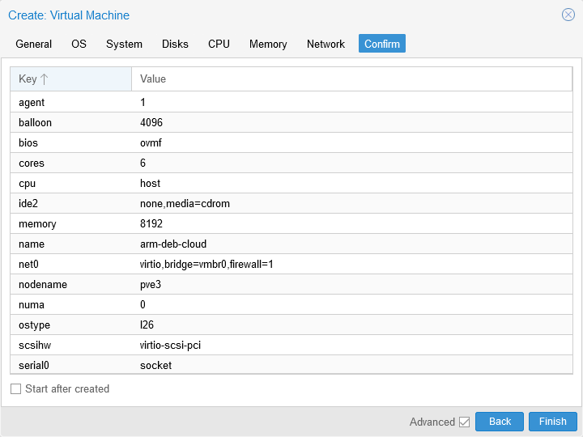
3.手动修改虚拟机配置文件以设置 CPU 架构并更改（或删除）CPU 型号。
文件：nano /etc/pve/qemu-server/20001.conf >>>>>>
>>>>>> 4.设置 UEFI 固件
4.1安装固件包或克隆时会遇到以下错误。这是通用的UEFI固件（预引导加载程序），也存在于TianoCore的Android固件中。花絮：在KVM/QEMU上，VM启动时的Proxmox徽标实际上默认拼写为TianoCore。 # ensure you have subscription or no-subscription repository working
apt install -y pve-edk2-firmware-aarch64 如果缺少，则错误： TASK ERROR: clone failed: EFI base image '/usr/share/pve-edk2-firmware//AAVMF_CODE.fd' not found 4.2添加 EFI 磁盘。这只需在架构更改后实例化正确的固件。
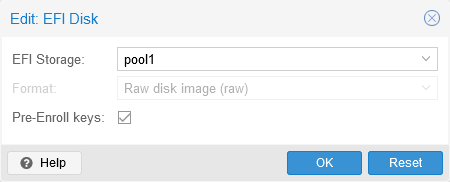
如果您在步骤 2 中错误地添加了 EFI 磁盘，则在克隆时会遇到以下错误。 TASK ERROR: clone failed: command 'qemu-img dd -n -O raw 'bs=1048576' 'osize=67108864' 'if=rbd:pool1/base-20001-disk-0:conf=/etc/pve/ceph.conf:id=admin:keyring=/etc/pve/priv/ceph/pool1.keyring' 'of=rbd:pool1/vm-20002-disk-0:conf=/etc/pve/ceph.conf:id=admin:keyring=/etc/pve/priv/ceph/pool1.keyring'' failed: exit code 1 4.3如果在群集中，请确保已在克隆目标节点上安装固件包，或者在启动 VM 时会遇到以下错误。 TASK ERROR: EFI base image '/usr/share/pve-edk2-firmware//AAVMF_CODE.fd' not found 5.将下载的 qcow2 文件的副本附加为 VM 磁盘。下载的文件可以在之后删除。 qm importdisk 20001 ./debian-12-genericcloud-arm64.qcow2 pool1
# rm ./debian-12-genericcloud-amd64.qcow2 最好选择丢弃（Discard）。
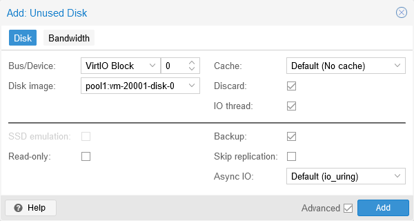
右侧的IO thread 不要选择，这个只支持 virtio，这里选择的话会报警告。
6.添加 Cloudinit。需要在克隆上覆盖这一代。
必须是 SCSI。
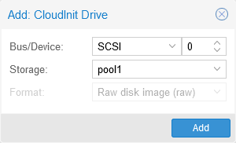
重新生成 CloudInit。
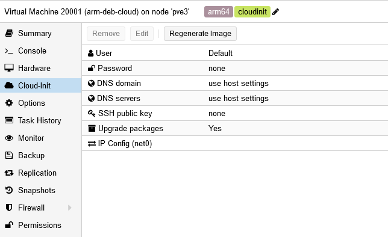
您可以检查启动顺序以查看它是否有效。
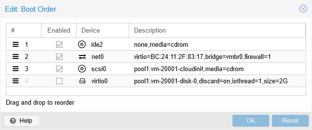
7.必须删除 IDE CD/DVD 驱动器。即使您将使用 ISO 映像，IDE 也会阻碍引导，因此请重新添加为 SCSI。
也可以简单地从配置文件中删除。ide2: none,media=cdrom
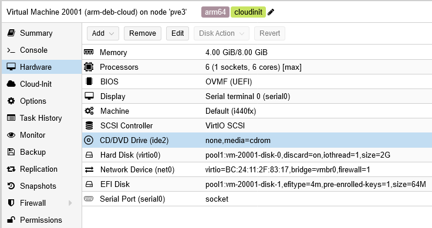
另外要注意SCSI控制器必须是 SCSI，不能是 SCSI single。否则会报错： qemu-system-aarch64: -device virtio-scsi-pci,id=virtioscsi0,bus=pcie.3,addr=0x1,iothread=iothread-virtioscsi0: Bus 'pcie.3' not found 8.设置系统盘的启动顺序。Cloudinit 无需启用。
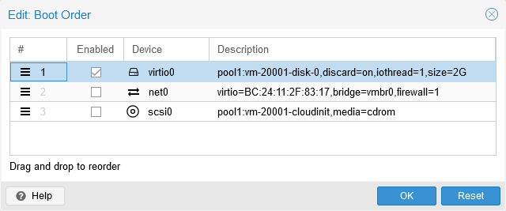
9.将 VM 转换为模板。（可以在任何步骤中完成）

10.克隆模板。到目前为止提到的任何错误都将在此步骤或启动克隆的 VM 时遇到。
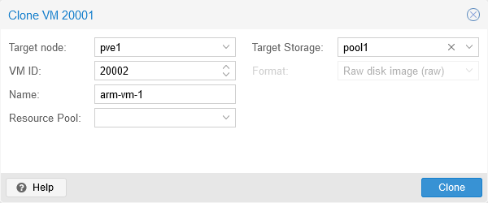
11.启动 VM
增加磁盘大小。
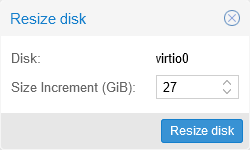
设置用户

密码

SSH 密钥。通过以下方式创建密钥：ssh-keygen -t ed25519 -f ~/.ssh/keypair/hlab2-cbugk -C "" -N ""
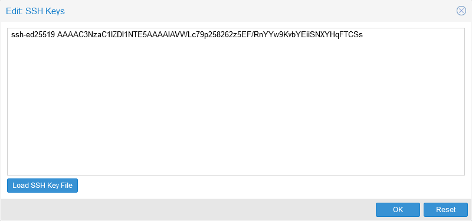
在这种情况下设置网络，IPv4 DHCP：
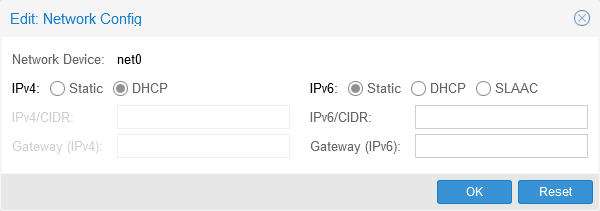
如果未设置网络，VM 将无限期停止：
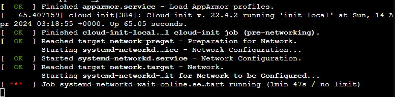
Start 将导致 cloudinit ISO 的重新生成。 generating cloud-init ISO 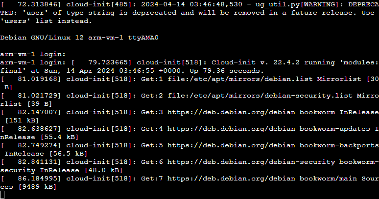
12.如果您想使用 ISO 进行安装，例如 Fedora 40 IoT arm64。
添加 CD/DVD 驱动器
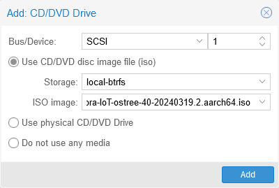
设置为第一个启动设备
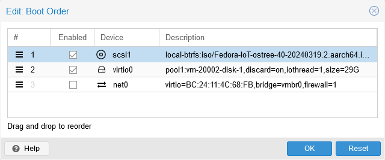
13.安装操作系统：
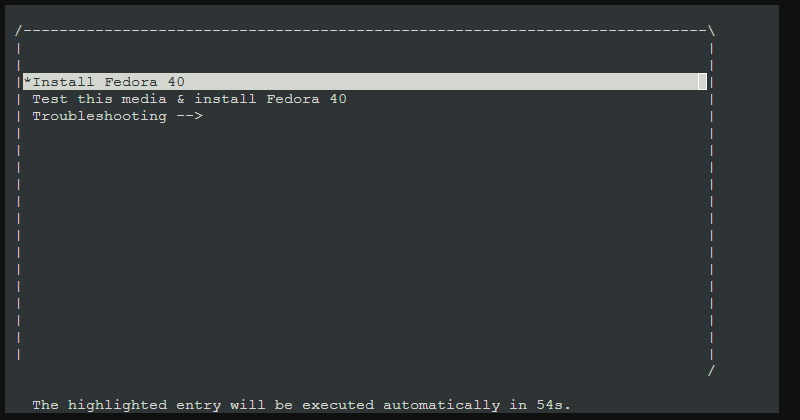
14.请记住删除 CD/DVD 驱动器。
最终结果
生成的配置文件如下。
/etc/pve/qemu-server/20001.conf在 PVE3 上： agent: 1
arch: aarch64
balloon: 4096
bios: ovmf
boot: order=virtio0
cores: 6
cpu: max
efidisk0: pool1:base-20001-disk-1,efitype=4m,pre-enrolled-keys=1,size=64M
memory: 8192
meta: creation-qemu=8.1.2,ctime=1713062225
name: arm-deb-cloud
net0: virtio=BC:24:11:2F:83:17,bridge=vmbr0,firewall=1
numa: 0
ostype: l26
scsi0: pool1:vm-20001-cloudinit,media=cdrom
scsihw: virtio-scsi-pci
serial0: socket
smbios1: uuid=79271524-d044-4ceb-9684-dd1282afff38
sockets: 1
tags: arm64;cloudinit
template: 1
vga: serial0
virtio0: pool1:base-20001-disk-0,discard=on,iothread=1,size=2G /etc/pve/qemu-server/20002.conf在 PVE1 上：
boot: order=scsi1;virtio0
cipassword: # REDACTED
ciuser: cbugk
efidisk0: pool1:vm-20002-disk-0,efitype=4m,pre-enrolled-keys=1,size=64M
hotplug: disk,network,usb
ipconfig0: ip=dhcp
name: arm-vm-1
net0: virtio=BC:24:11:4C:68:FB,bridge=vmbr0,firewall=1
scsi0: pool1:vm-20002-cloudinit,media=cdrom,size=4M
scsi1: local-btrfs:iso/Fedora-IoT-ostree-40-20240319.2.aarch64.iso,media=cdrom,size=2457002K
smbios1: uuid=0d2efdf5-32bd-4eb5-a1c0-ade1f909cd1e
sshkeys: ssh-ed25519%20AAAAC3NzaC1lZDI1NTE5AAAAIAVWLc79p258262z5EF%2FRnYYw9KvbYEiiSNXYHqFTCSs
virtio0: pool1:vm-20002-disk-1,discard=on,iothread=1,size=29G
在Proxmox上通过Cloud-init创建ARM虚拟机 – 指尖风暴 Typhon Finger qemu-system-aarch64: -device usb-ehci,id=ehci,bus=pci.0,addr=0x1: Duplicate ID 'ehci' for device
qemu-system-aarch64: -device virtio-scsi-pci,id=virtioscsi0,bus=pcie.3,addr=0x1: Bus 'pcie.3' not found
qemu-system-aarch64: -device ide-hd,bus=ide.0,unit=0,drive=drive-ide0,id=ide0,rotation_rate=1: Bus 'ide.0' not found
qemu-system-aarch64: -device vmgenid,guid=c2826a61-f1e6-44b3-876a-b5f82a0d17cb: 'vmgenid' is not a valid device model name
mkdir -p ~/prj/arm-deb-cloud
cd ~/prj/arm-deb-cloud
wget https://cloud.debian.org/images/cloud/bookworm/latest/debian-12-genericcloud-arm64.qcow2
>>>>>>
# ensure you have subscription or no-subscription repository working
apt install -y pve-edk2-firmware-aarch64
TASK ERROR: clone failed: EFI base image '/usr/share/pve-edk2-firmware//AAVMF_CODE.fd' not found
TASK ERROR: clone failed: command 'qemu-img dd -n -O raw 'bs=1048576' 'osize=67108864' 'if=rbd:pool1/base-20001-disk-0:conf=/etc/pve/ceph.conf:id=admin:keyring=/etc/pve/priv/ceph/pool1.keyring' 'of=rbd:pool1/vm-20002-disk-0:conf=/etc/pve/ceph.conf:id=admin:keyring=/etc/pve/priv/ceph/pool1.keyring'' failed: exit code 1
TASK ERROR: EFI base image '/usr/share/pve-edk2-firmware//AAVMF_CODE.fd' not found
qm importdisk 20001 ./debian-12-genericcloud-arm64.qcow2 pool1
# rm ./debian-12-genericcloud-amd64.qcow2
另外要注意SCSI控制器必须是 SCSI，不能是 SCSI single。否则会报错：qemu-system-aarch64: -device virtio-scsi-pci,id=virtioscsi0,bus=pcie.3,addr=0x1,iothread=iothread-virtioscsi0: Bus 'pcie.3' not found
generating cloud-init ISO
agent: 1
virtio0: pool1:base-20001-disk-0,discard=on,iothread=1,size=2G