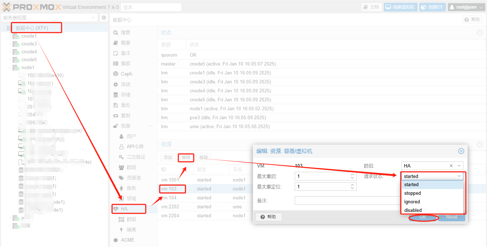

# Requesting HA stop for VM 101 service 错误解决
原始链接：[https://www.280i.com/series/pve](https://www.280i.com/series/pve)

## 技术信息

**错误内容：**
```
Requesting HA stop for VM 101
service 'vm:101' in error state, must be disabled and fixed first
TASK ERROR: command 'ha-manager crm-command stop vm:101 0' failed: exit code 255
```

**对应指令：**

```bash
ha-manager set vm:101 --state disabled
```

**界面操作方法：**


经过以上操作后，锁定的VM会自动关闭状态，然后启动即可。

操作完成后记得恢复HA的状态，避免迁移失败。