# 网络设置指南
原始链接：[https://www.280i.com/series/pve](https://www.280i.com/series/pve)
## 技术信息
此文章为英文文章的翻译收藏版本。
原文：https://dev.to/duelnm/setting-up-arm-vm-on-proxmox-ve-47a0
译文：
通过添加 ARM64 仿真支持，可以在 Proxmox VE 上运行 ARM64 虚拟机。本指南将引导您完成在Proxmox VE上创建和运行ARM64 VM所需的步骤，无论是用于测试、开发还是其他目的。
免责先决条件
首先，确保软件包已安装。此软件包提供 ARM64 VM 集成所需的 （U）EFI 固件。请注意，此包不会在升级过程中自动安装，因此需要手动安装。pve-edk2-firmware-aarch64 apt update
apt install pve-edk2-firmware-aarch64 将 ARM64 ISO 上传到 Proxmox VE
您需要一个 ARM64 ISO 映像，在本指南中，我们将使用 Debian 12 “Bookworm”。确保您使用的是 AArch64 ISO，这是 64 位 ARM 体系结构的正式名称。将ISO上传到您的Proxmox VE存储。
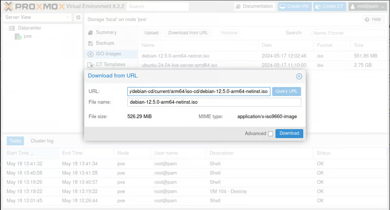
Upload ISO to Proxmox VE
创建新的 VMCreate a new VM
要创建新的VM，请单击Proxmox VE界面中的“创建VM”按钮。为 VM 分配名称和 ID。
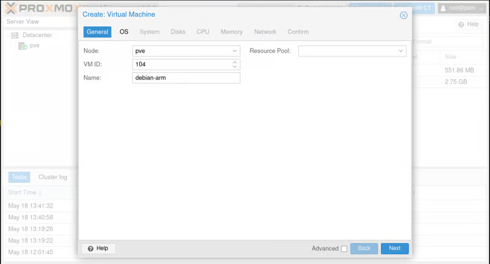
Create VM
在“操作系统”选项卡中，通过选择“不使用任何媒体”来禁用 CD/DVD 驱动器。
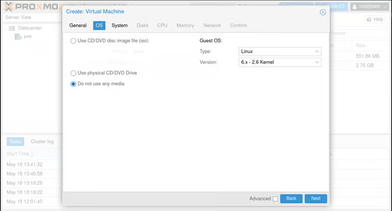
OS Tab
在“系统”选项卡中，将显卡设置为“串行终端 0”，将 BIOS 更改为“OVMF （UEFI）”，然后取消选中“添加 EFI 磁盘”框来禁用 EFI 磁盘创建（稍后我们将手动创建它）。确保SCSI控制器设置为“VirtIO SCSI”。
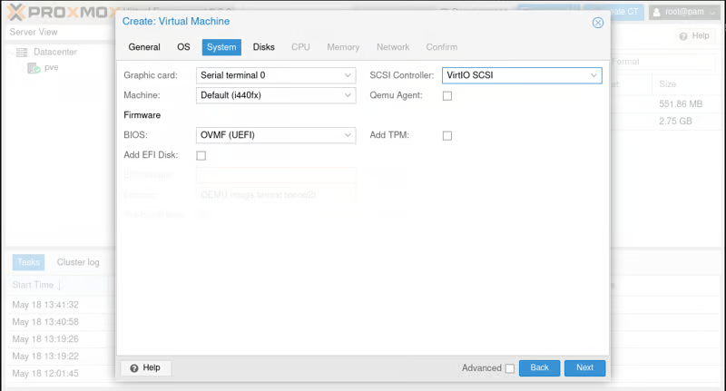
System Tab
接下来，在“磁盘”选项卡中，选择 VM 的存储和空间分配，确保通过取消选中该框来禁用“IO 线程”。
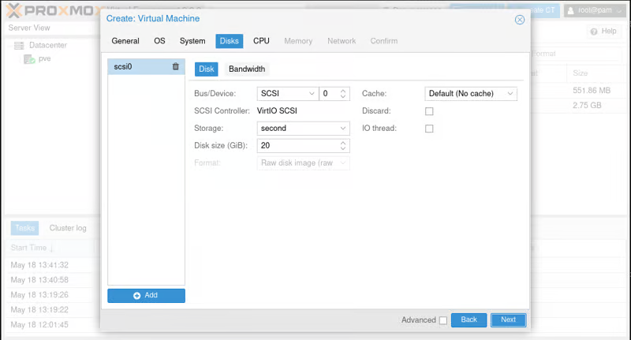
Disks Tab
在 CPU 选项卡中，不要添加 CPU 类型，将其保留为默认值。
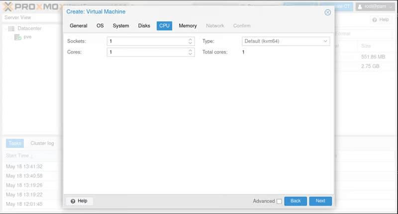
CPU Tab
在“内存”选项卡中分配所需的 RAM 量，无需在“网络”选项卡中进行任何更改。
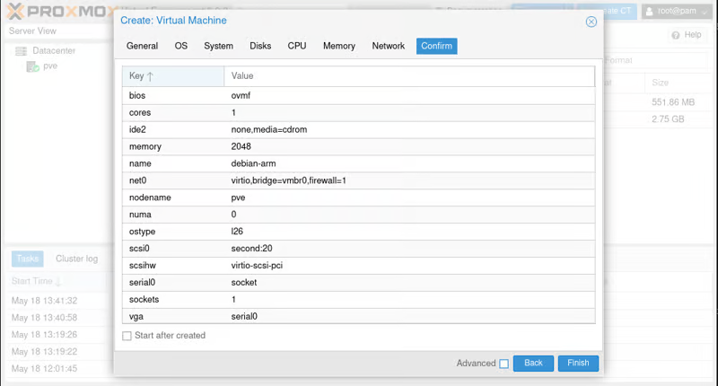
Confirm Tab
修改 VM 硬件
创建 VM 后，转到硬件设置以删除现有的 CD/DVD 驱动器。然后，通过选择“SCSI”作为总线/设备并选择您之前上传的 Debian ISO 映像来添加一个新的。
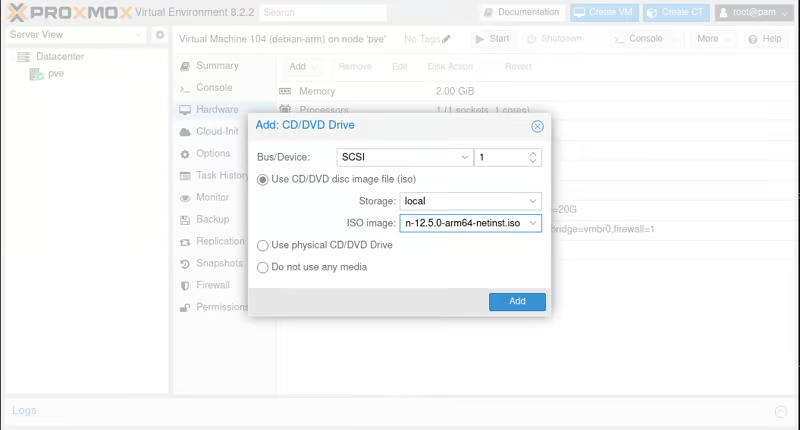
Hardware
编辑 VM 配置文件
通过添加和修改行来编辑位于 的配置文件，如下所示：/etc/pve/qemu-server/.conf nano /etc/pve/qemu-server/.conf 在文件底部添加：arch: aarch64 arch: aarch64 注释掉开头的行，在开头添加 a：vmgenid:# vmgenid: 删除以 开头的行（如果存在）：cpu: cpu: 调整启动顺序
转到虚拟机的“选项”并更改“引导顺序”，将 CD/DVD 驱动器与 Debian ISO 作为第一个引导设备。
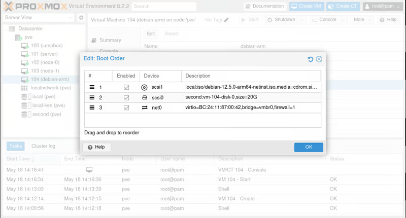
Boot Order
创建EFI磁盘
此任务也可采用WebUI创建
运行以下命令，为 VM 创建 EFI 磁盘，并替换为实际的 VM ID： qm set --efidisk0 second:1,efitype=4m,format=raw 示例： qm set 103 --efidisk0 local-lvm:0,efitype=4m,format=raw 启动 VM 并安装操作系统Launch the VM and install the OS
启动 VM 并按照提示完成 Debian 安装。强烈建议使用 Proxmox VE 界面中的xterm.js选项连接到 VM，以获得更流畅的安装体验。
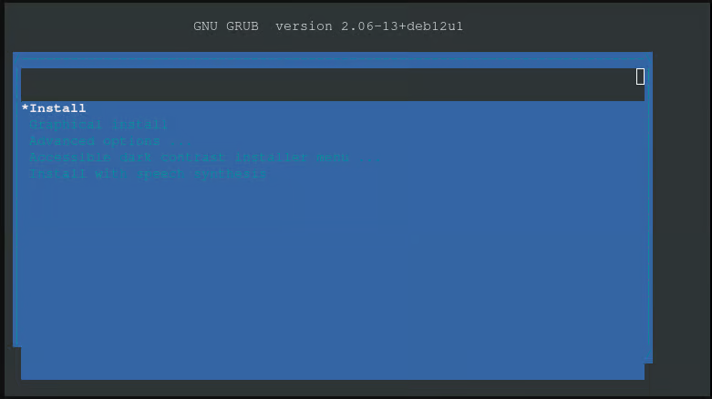
Launch VM
安装中：
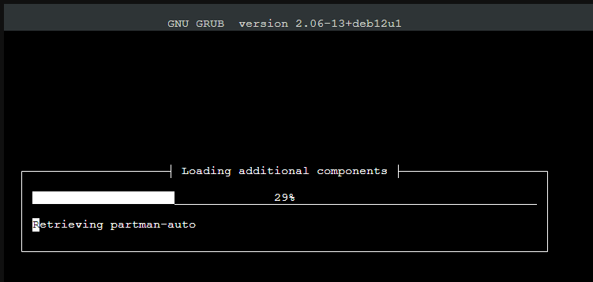
安装后
操作系统安装完成后，转到 VM 硬件设置，移除 CD/DVD 驱动器，然后将“显示”更改为 VNC。然后重新启动 VM，以确保它从已安装的操作系统正确启动。 恭喜！现在，您已在Proxmox VE上运行ARM64 VM。
故障 排除
如果遇到以下错误： qemu-system-aarch64: -drive if=pflash,unit=1,id=drive-efidisk0,format=raw,file=/dev/second/vm-104-disk-1,size=67108864: The sum of offset (0) and size (0) has to be smaller or equal to the actual size of the containing file (4194304) 请按照下列步骤解决该问题：
通过转到 VM 的“硬件”选项卡，选择 EFI 磁盘，然后单击“删除”来删除 EFI 磁盘。
使用以下命令重新创建 EFI 磁盘，并替换为实际的 VM ID：
再次启动 VM。
就这样！我希望您喜欢此内容并在 Proxmox 上使用 ARM VM。
在Proxmox VE上设置ARM VM – 指尖风暴 Typhon Finger 通过转到 VM 的"硬件"选项卡，选择 EFI 磁盘，然后单击"删除"来删除 EFI 磁盘。