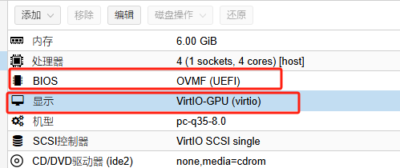
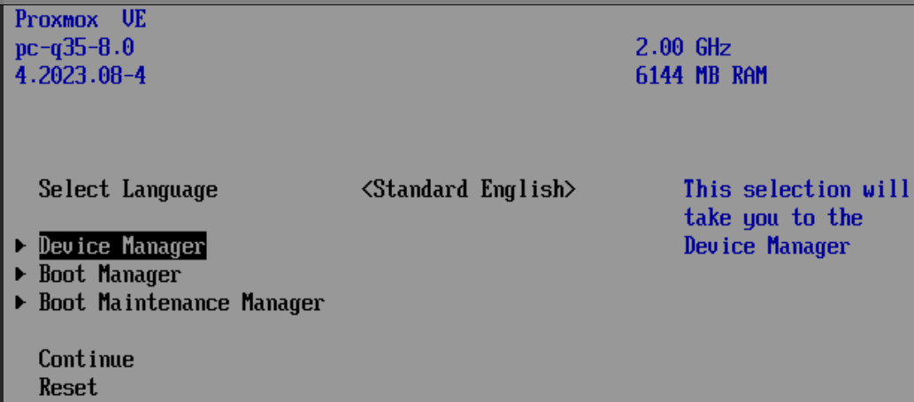
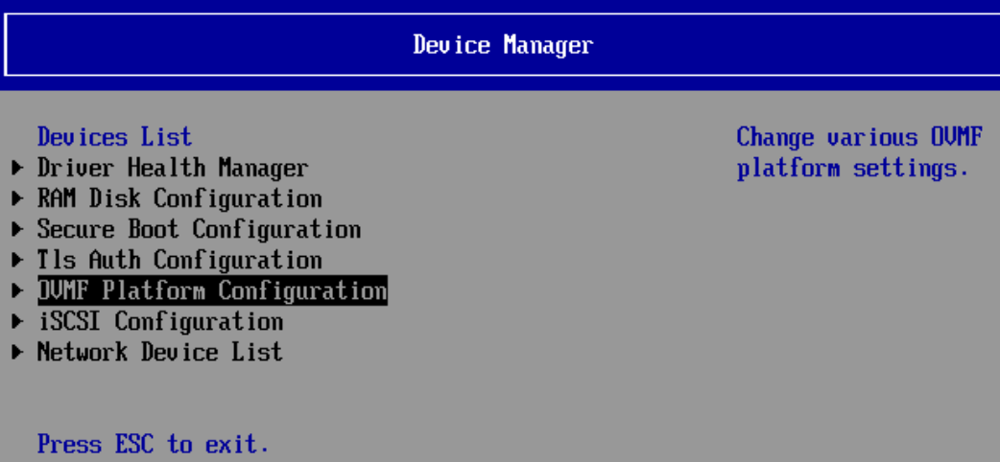
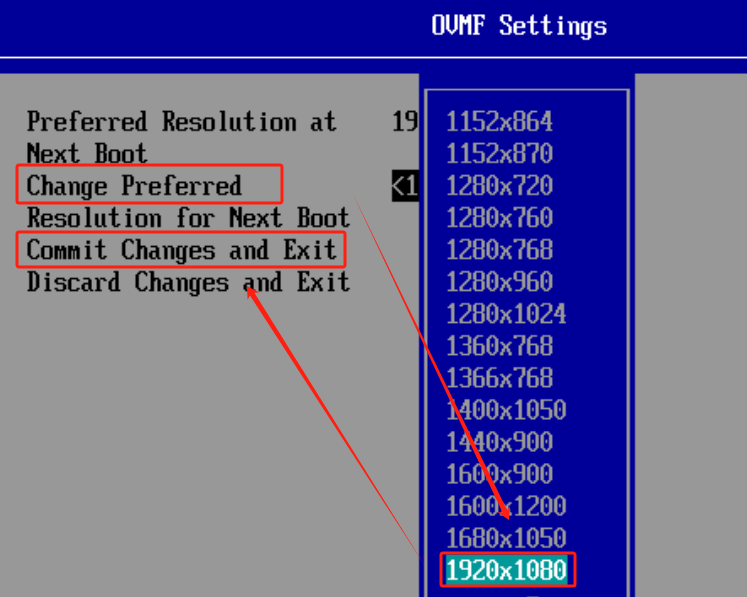
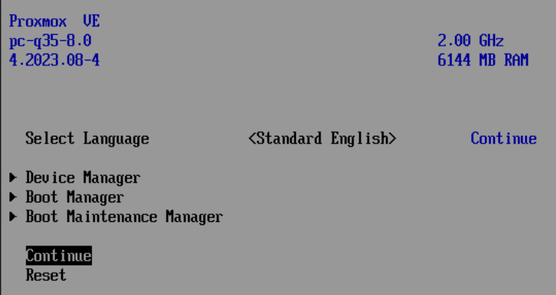

# OVMF格式与VirtIO-GPU配置指南
原始链接：[https://www.280i.com/series/pve](https://www.280i.com/series/pve)

## 技术信息

1. 确保硬件是OVMF格式，并修改显示为VirtIO-GPU

2. 开机ESC进入bios

3. DeviceManager – OVMF Platform Configuration

4. 选择分辨率后确认保存

5. ESC到主界面，然后保存

6. 进入系统查看分辨率
