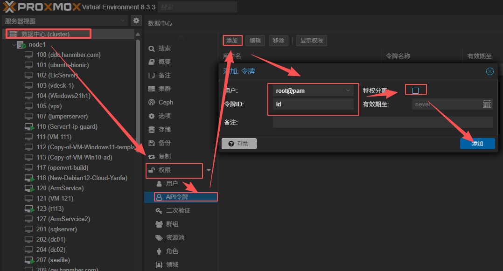
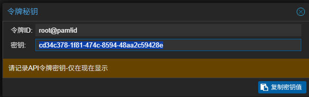
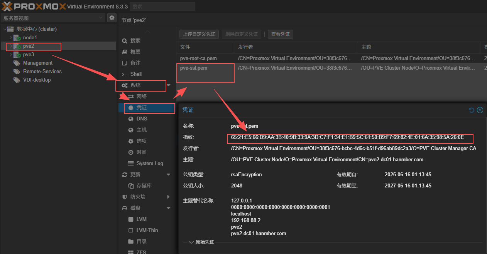

---
title: qm remote-migrate 命令详解
tags: [Proxmox, 技术]

# qm remote-migrate 命令详解
原始链接：[https://www.280i.com/series/pve](https://www.280i.com/series/pve)

## 技术信息

**官方方法：**
qm remote-migrate

**版本要求：**
PVE7.3以上

**命令详解：**

```bash
qm remote-migrate <source-vmid> <target-vmid> <remote-endpoint> --target-bridge <bridge> --target-storage <storage> [OPTIONS]
```

**命令说明：**
Migrate virtual machine to a remote cluster. Creates a new migration task. EXPERIMENTAL feature!

**参数说明：**
- `<source-vmid>`: (100 - 999999999) - The (unique) ID of the VM.
- `<target-vmid>`: (100 - 999999999) - The (unique) ID of the VM on the target cluster.
- `<remote-endpoint>`: apitoken=...,host=... [,fingerprint=...] [,port=...]
- `--bwlimit (0 - N)`: Override I/O bandwidth limit (in KiB/s).
- `--delete (default = 0)`: Delete the original VM and related data after successful migration.
- `--online`: Use online/live migration if VM is running.
- `--target-bridge`: Mapping from source to target bridges.
- `--target-storage`: Mapping from source to target storages.

**示例命令：**

```bash
qm remote-migrate SOURCEVMID TARGETVMID apitoken='Authorization: PVEAPIToken=root@pam!id=c362d275-5e68-4482-a4c1-a0114c2ea408',host=TARGETIP,port=8006,fingerprint=65:21:E5:66:D9:AA:3B:40:9B:33:9A:3D:C7:F1:34:E1:B9:5C:61:50:B9:F7:69:82:4E:01:6A:35:98:5A:26:0E --target-bridge=vmbr0 --target-storage=ZFS-Mirror --online=true
```

**apitoken介绍：**

添加API：特权分离去掉


复制秘钥：添加完成后会弹出页面


**fingerprint介绍：**



命令行查看：

```bash
pvenode cert info --output-format json | jq -r '.[1]["fingerprint"]'
```