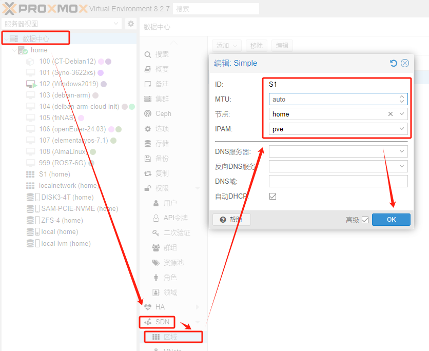
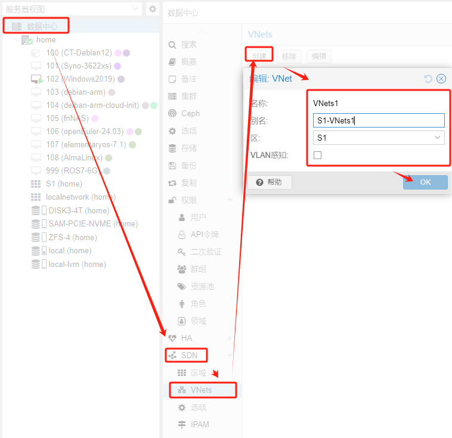
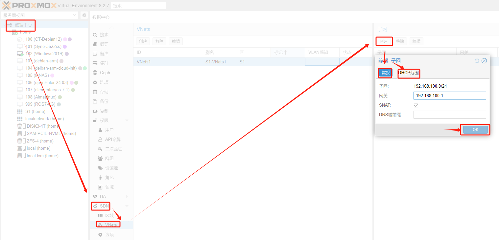
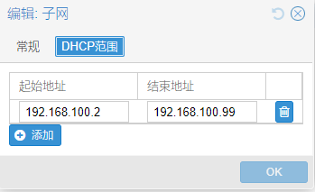
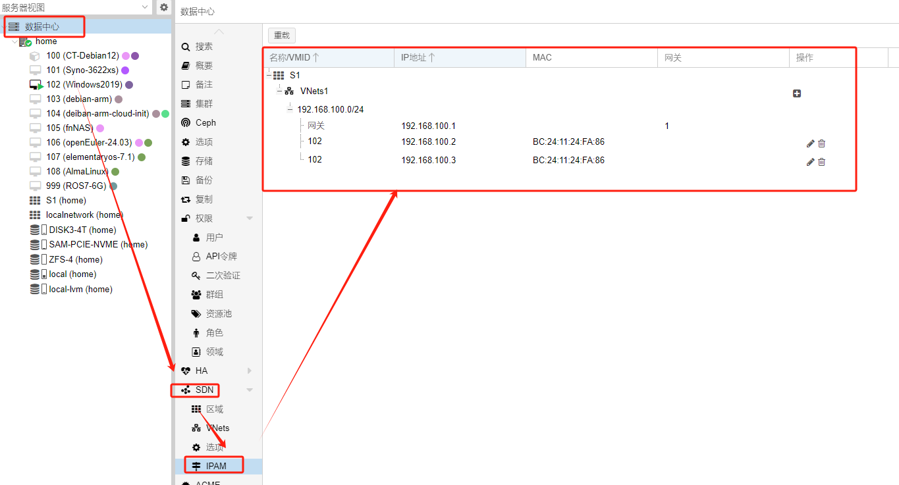

---
title: SDN Simple 网络配置指南
tags: [Proxmox, 技术]
# SDN Simple 网络配置指南
原始链接：[https://www.280i.com/series/pve](https://www.280i.com/series/pve)
## 技术信息
数据中心-SDN-添加-Simple
截图是现有的网络编辑，仅做参考。

这里需要选择对应节点，否则节点上的虚拟机可能无法获取网络信息。
IPAM:IP Address Management 管理系统，主要解决企业内部的IP地址管理数字化。
数据中心-SDN-VNets-创建

名称和别名最好按照一定的规则，区域选择前面创建好的Simple网络。
数据中心-SDN-子网-创建

配置子网和网关，如果需要外部网络，需要开启SNAT（源地址NAT）
子网DHCP范围

数据中心-SDN-IPAM

IP地址管理，查看当前分配的IP地址和对应的虚机信息。