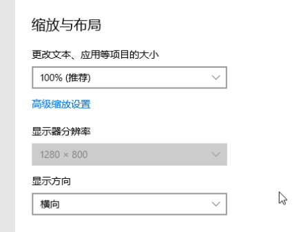
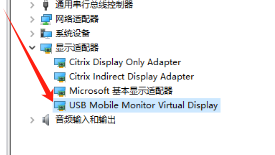
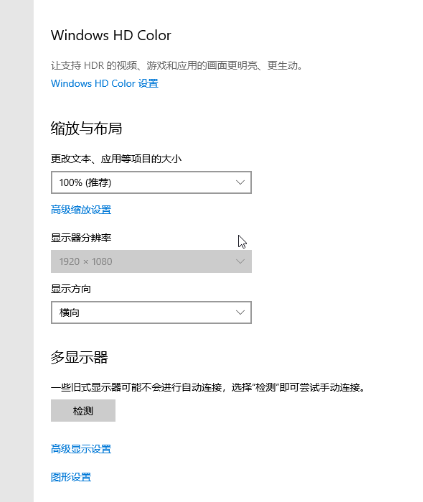

# 虚拟机BIOS分辨率修改指南
原始链接：[https://www.280i.com/series/pve](https://www.280i.com/series/pve)
## 技术信息
首先来看看虚拟机的默认情况：

首先通过修改BIOS里分辨率（ https://www.280i.com/tech/12409.html ），若还不生效
就可以按照这个方式
这个方式的原理是虚拟出一个USB的显示器

下载执行压缩包中的批处理文件，然后重启即可。

此处下载挂了付费，如果赞助本站就付费下载，如果不付费也可以去原站长那里下载。
原作者：https://blog.echoquants.com/post-10.html
PVE虚拟机无法修改分辨率 – 指尖风暴 Typhon Finger